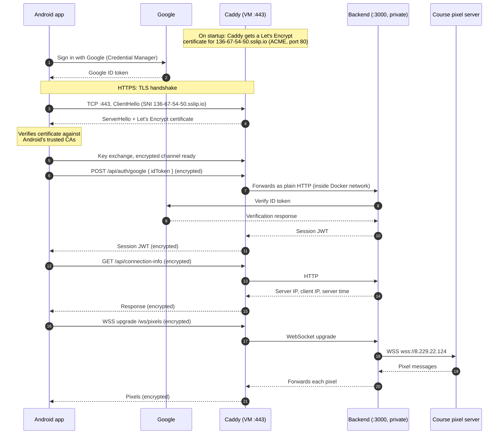

# Adam's Implementation of M1

## Overview

An Android app with three buttons on its home screen:

| Button | What it does |
|--------|--------------|
| **Sign in/Sign up with Google** | Signs in with Google, trades the Google ID token for a backend session, then opens a page showing the server's public IP, the client's IP, server time, client time, the name of the server owner returned by the backend (`Adam de Leeuw`) and the signed-in Google user's name. |
| **Connect to WebSocket** | Opens a 16×16 canvas and paints pixels live as they arrive from the course pixel server (relayed through this project's backend). |
| **Timer** | A countdown timer. When it hits zero, a "hit the crossbar" penalty mini-game takes over the screen until you win it. Runs entirely on the device, with no backend involved. |

The frontend is a Kotlin / Jetpack Compose Android app (`frontend/`). The backend is a Node.js / TypeScript Express server (`backend/`).

## Architecture

In production the backend runs in Docker on a GCP VM behind **Caddy**, which terminates HTTPS with a publicly trusted **Let's Encrypt** certificate for `136-67-54-50.sslip.io`. Port 3000 is never exposed to the internet; only Caddy can reach the backend, over the private Docker network.



Release builds of the app only allow HTTPS. Debug builds additionally allow plain HTTP to `10.0.2.2` so the app can talk to a backend running locally.

## Run the app with the APK

1. Open Android Studio.
2. Click the three dots in the top right corner and select **Virtual Device Manager**.
3. Add a new **Pixel 9** (Android 17.0 "CinnamonBun") device. This image includes Google Play.
4. Start the Pixel 9.
5. On the Pixel 9, **sign in to Google with your Google account**. Button 1 uses the account signed in on the device.
6. Drag the APK onto the emulator window to install it (or run `adb install -r app.apk`).
7. Swipe up from the bottom to open the app menu and select **CPEN321 Application**.

The APK points at the deployed backend, `https://136-67-54-50.sslip.io`. Any Google account can sign in.

## Build and deploy

Clone the repo:

```bash
git clone git@github.com:adamdeleeuw/cpen321-m1.git
cd cpen321-m1
```

### Backend

```bash
cd backend
cp .env.example .env
```

Fill in `backend/.env`:

```dotenv
GOOGLE_BACKEND_CLIENT_ID=<your Google Web client ID>.apps.googleusercontent.com
JWT_SECRET=<a random secret>
SERVER_PUBLIC_IP=<127.0.0.1 locally, or the VM's public IP>
```

**Local:**

```bash
npm install
npm run build && npm run start     # serves plain HTTP on http://localhost:3000
```

**VM:** the VM runs the backend and Caddy with Docker (Docker must be installed, and `backend/.env` must exist on the VM). The deploy script syncs the clone to `origin/main`, starts both containers and waits for `https://136-67-54-50.sslip.io/health` to respond:

```bash
~/cpen321-m1/scripts/deploy-backend.sh
```

In practice you don't run this by hand. The GitHub Actions workflow `.github/workflows/backend.yml` runs on every push to `main`: it typechecks, tests and builds the backend, then SSHes into the VM and runs `deploy-backend.sh`. This is the intended way to deploy the HTTPS server.

### Frontend

```bash
cd frontend
cp local.properties.example local.properties
```

Fill in `frontend/local.properties`:

```properties
sdk.dir=<path to your Android SDK>
GOOGLE_CLIENT_ID=<your Google Web client ID>.apps.googleusercontent.com

# pick one:
API_BASE_URL=http://10.0.2.2:3000             # backend running locally
API_BASE_URL=https://136-67-54-50.sslip.io    # backend deployed on the VM
```

Then build and run:

```bash
./gradlew build
```

1. Go to **Tools → Device Manager** and set up the Pixel 9 emulator as described in [Run the app with the APK](#run-the-app-with-the-apk).
2. Click **Run app** (the green play button) in Android Studio.
